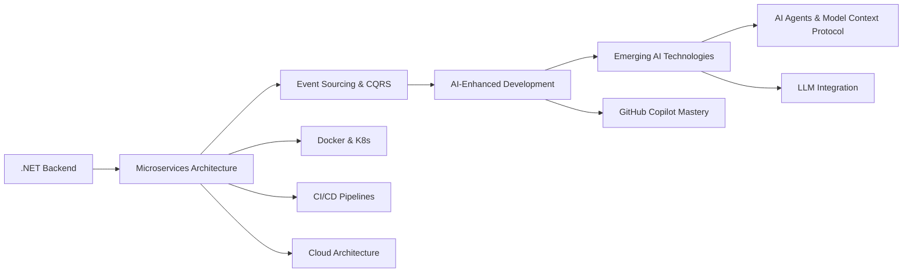

# 👋 Hi there, I'm Faysil Alshareef!

### 🚀 Mid Software Engineer | Microservices Architect | AI-Enhanced Developer

📍 **Tripoli, Libya** | 📞 **+218915229448**

---

## 🧑‍💻 About Me

> *"Continuous learning and adaptation are the keys to success in the ever-evolving world of technology."*

Experienced Software Engineer with **2+ years** of expertise in developing enterprise-level microservices applications using .NET and modern cloud technologies. Specialized in building scalable systems for **sales, purchasing, and financial card management**. Currently serving as a **Mid Software Engineer at ANIS** since July 2023, where I lead technical initiatives, mentor team members, and deliver high-quality solutions using microservices architecture, event sourcing, and distributed systems.

### 🌟 Key Highlights

- 🏢 **Mid Software Engineer** at ANIS (July 2023 - Present)
- 🚀 Expert in **Microservices Architecture** & **Event Sourcing**
- 🤖 **GitHub Copilot Expert User** - AI-Assisted Development Pioneer
- 📈 Increased development velocity by **30%+** through AI-powered coding practices
- 👥 Technical trainer and mentor for team members
- 💼 Open for **part-time opportunities**

### 📊 GitHub Stats

---

## 🚀 Professional Experience

### **Mid Software Engineer** | ANIS | *July 2023 - Present*

#### 🎯 Core Responsibilities
- 🏗️ Develop and maintain **microservices-based applications** for the ANIS-Card system
- 💳 Handle **sales and purchases catalog management**, card systems, and external transfers
- 🎨 Build interactive management dashboards using **Blazor WebAssembly**
- 🤖 Leverage **GitHub Copilot** extensively to accelerate development and improve code quality
- 🏦 Build systems for **financial card management**, external money transfers, competitions, and promotional draws
- 👨‍💼 Lead technical initiatives and coordinate with Seniors support team for architectural decisions
- 📚 Conduct technical training sessions on microservices patterns, event sourcing, and AI-assisted development
- 🔄 Implement **CI/CD pipelines** using GitHub Actions for automated deployment to Kubernetes clusters

#### 🏆 Key Achievements
- ✅ Successfully delivered multiple enterprise systems for **card management and financial transactions**
- 📊 Developed **real-time management dashboards** using Blazor WebAssembly
- 🚀 Increased development velocity by **30%+** through expert use of GitHub Copilot
- ⚡ Improved system scalability by implementing **event-driven microservices architecture**
- 👥 Enhanced team productivity through **technical training and mentorship programs**
- 🎯 Contributed to architectural decisions improving performance and maintainability

**Tech Stack:** .NET 8, ASP.NET Core, Blazor WebAssembly, C#, gRPC, Microservices, Event Sourcing, SQL Server, Cosmos DB, Kubernetes, GitHub Copilot, GitHub Actions

### **Software Engineer** | Growth Tech | *April 2023 - July 2023*

- 🔧 Developed new processes and applications using **C#** and **.NET Framework**
- 🔄 Created automations using various system APIs
- 🧪 Performed code modifications, unit testing, and defect fixes

---

## 🛠️ Technology Stack

### Backend Development & Architecture

### Database Technologies

### Communication Protocols

### DevOps & Cloud

### AI & Productivity Tools

### Tools & Platforms

---

## 🎓 Expertise & Architecture Patterns

| Category | Technologies |
|:--------:|:------------|
| **🏗️ Architecture** | Microservices Architecture, Event Sourcing, CQRS, Gateway Pattern, Domain-Driven Design (DDD) |
| **🤖 AI Development** | GitHub Copilot Expert User, AI-Assisted Development, Code Generation, AI-Powered Testing |
| **☁️ Cloud & DevOps** | Kubernetes (K8s), Docker, CI/CD Pipelines, Container Orchestration, GitHub Actions |
| **👨‍💼 Leadership** | Team Coordination, Technical Training, Mentoring, Code Reviews |
| **🌐 Communication** | English (Professional), Arabic (Native) |

## 📚 Learning Journey & Current Focus

### 🎯 Currently Exploring

| 🤖 AI & Emerging Tech | ☁️ DevOps & Cloud | 🏗️ Architecture |
|:---------------------|:-----------------|:---------------|
| AI Agents | Docker & Kubernetes | Microservices Patterns |
| Model Context Protocol (MCP) | CI/CD Optimization | Distributed Systems |
| Large Language Models | Ansible Automation | Event-Driven Design |
| AI-Assisted Testing | Cloud-Native Apps | Scalability Patterns |

### 📖 Continuous Learning Areas
- 🤖 **AI Agents Architecture** & Model Context Protocol (MCP) Server & Client Development
- 🔄 **Event Sourcing & CQRS** Implementation
- ☁️ **Cloud-Native** Application Development
- 🐳 **Container Orchestration** with Kubernetes
- 📊 **Monitoring and Observability**
- 🔧 **Infrastructure as Code** with Ansible

---

## 🎯 Goals & Aspirations

| Short Term (6 months) | Medium Term (1 year) | Long Term (2+ years) |
|:----------------------:|:---------------------:|:--------------------:|
| 🤖 Master AI Agents & MCP | ☁️ Cloud Architecture Expert | 🏗️ Solution Architect |
| 🐳 Advanced K8s Patterns | 🔄 DevOps Leadership | 🌟 Open Source Leadership |
| 📈 System Optimization | 🎯 Distributed Systems Mastery | 🚀 Innovation & R&D |
| 🧠 LLM Integration | 👥 Team Lead Position | 🌍 International Impact |

---

## 💼 Professional Services

### ✨ Available for Part-Time Opportunities

I'm open to collaborating on exciting projects! My expertise includes:

| Service | Description |
|:--------|:------------|
| 🏗️ **Microservices Architecture** | Design and implement scalable microservices systems |
| 🤖 **AI-Enhanced Development** | Leverage AI tools for rapid development and code quality |
| 💳 **Financial Systems** | Build secure card management and payment systems |
| 🎨 **Blazor Development** | Create interactive web applications with Blazor |
| 📚 **Technical Training** | Conduct training sessions on modern .NET and AI tools |
| 🔍 **Code Reviews & Consulting** | Provide expert guidance on architecture and best practices |

---

## 🤝 Let's Connect!

I'm always interested in collaborating on exciting projects and learning from fellow developers!

---

### 💬 Ask me about
**Microservices Architecture** • **Event Sourcing** • **AI-Assisted Development** • **Blazor** • **Financial Systems** • **.NET 8**

### 🌱 Currently learning
**AI Agents** • **Model Context Protocol** • **LLM Integration** • **Cloud Architecture** • **Advanced Kubernetes**

### ⚡ Fun fact
I increased my team's development velocity by **30%+** using GitHub Copilot and AI-powered development practices!

### 🎓 Teaching & Mentoring
I conduct regular training sessions on:
- 🏗️ Microservices & Event Sourcing patterns
- 🤖 AI-assisted development with GitHub Copilot
- 🚀 Modern .NET development best practices
- 💡 Clean Architecture & Domain-Driven Design

---

### 📊 Activity Graph

**⭐ Star my repositories if you find them helpful! ⭐**

