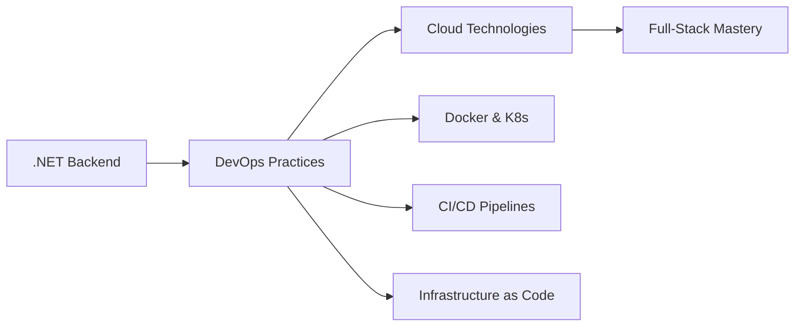

# 👋 Hi there, I'm Faysil Alshareef!

### 🚀 .NET Backend Engineer | DevOps Enthusiast | Cloud Explorer

---

## 🧑‍💻 About Me

> *"Continuous learning and adaptation are the keys to success in the ever-evolving world of technology."*

I'm a passionate .NET Backend Engineer with experience since **April 2023**, dedicated to building robust and scalable applications. Currently expanding my expertise in DevOps practices and cloud technologies while working on enterprise-level solutions at **Ecom-LTD**.

### 📊 GitHub Stats

---

## 🚀 Professional Experience

**Backend Engineer (.NET)** | *April 2023 - Present*
- 🔧 Developing and maintaining backend applications using .NET framework
- 🌐 Building RESTful APIs and web services for enterprise solutions
- 💾 Working with databases and implementing efficient data access patterns
- 🤝 Collaborating with cross-functional teams to deliver high-quality software solutions
- 🏢 Contributing to major projects at **Ecom-LTD** including gateway systems and merchant pricing solutions

---

## 🛠️ Technology Stack

### Backend Development

### DevOps & Cloud (Learning)

### Tools & Platforms

---

## 📈 Current Projects & Contributions

---

## 📚 Learning Journey

**Currently Focusing On:**
- 🐳 Container orchestration with Docker & Kubernetes
- 🔧 Infrastructure automation with Ansible
- ☁️ Cloud-native application development
- 🔄 CI/CD pipeline optimization
- 📊 Monitoring and observability

---

## 🎯 Goals & Aspirations

| Short Term (6 months) | Medium Term (1 year) | Long Term (2+ years) |
|:----------------------:|:---------------------:|:--------------------:|
| 🐳 Master Docker & K8s | ☁️ Cloud Certification | 🏗️ Solution Architecture |
| 🔧 Ansible Automation | 🔄 Advanced DevOps | 🌟 Open Source Leadership |
| 📈 Performance Optimization | 🏢 Team Leadership | 🚀 Innovation & R&D |

---

## 🤝 Let's Connect!

I'm always interested in collaborating on exciting projects and learning from fellow developers!

**💬 Ask me about:** .NET Development, API Design, Database Architecture, DevOps Practices

**🌱 Currently learning:** Kubernetes, Cloud Architecture, Microservices Patterns

**⚡ Fun fact:** I believe the best code is the code that doesn't need to be written!

---

### 📊 Activity Graph

**⭐ Star my repositories if you find them helpful! ⭐**

